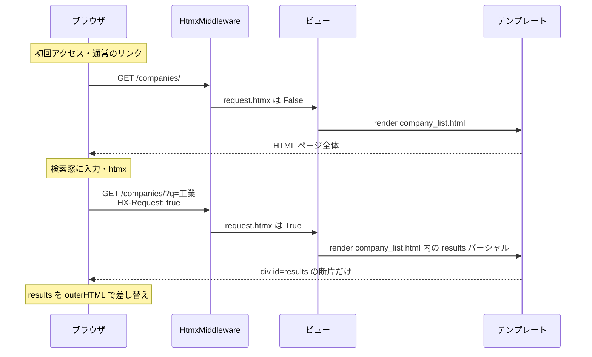
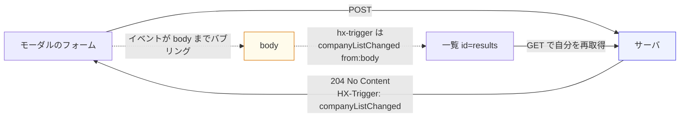
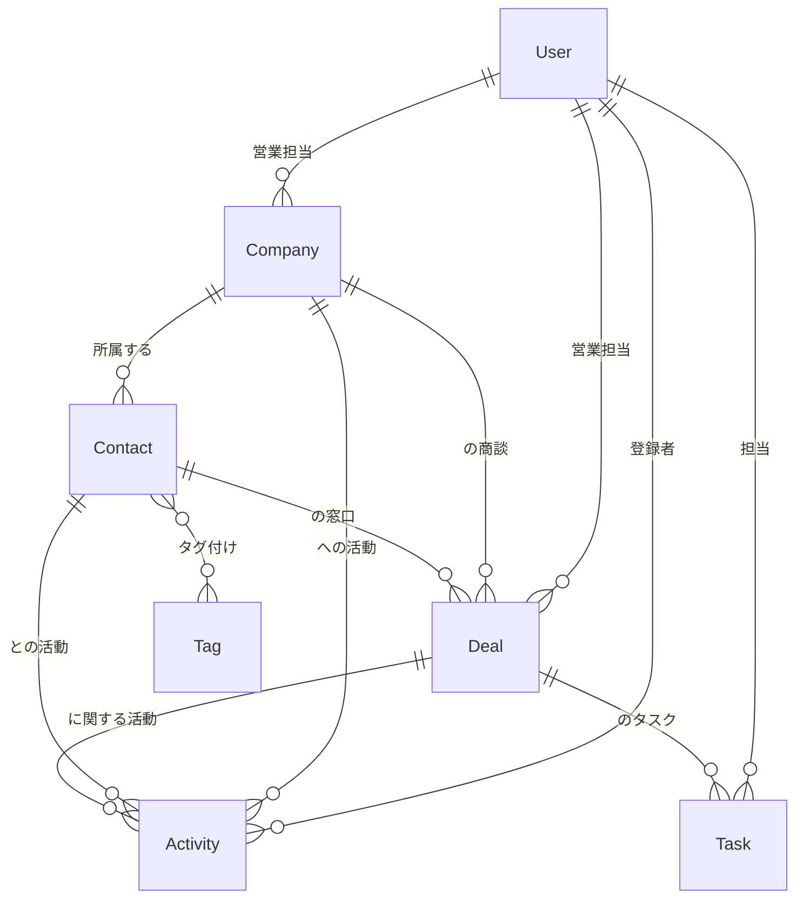

# 02. アーキテクチャ

## 設計方針

このアプリには **JavaScript のフレームワークがありません**。
その代わり、次の3つの原則を徹底しています。

1. **状態はサーバにしかない** — クライアントに「編集中かどうか」などを持たせない
2. **返すのは HTML の断片** — JSON を返して JS で組み立てる、をしない
3. **画面の更新指示はレスポンスヘッダ** — `HX-Trigger` でイベントを飛ばす

結果として、`static/js/app.js` は **約 160 行** に収まっています。
書いてあるのは「サーバから飛んでくるイベントの受け口」と
「SortableJS の初期化」だけで、業務ロジックは 1 行もありません。

---

## リクエストの流れ

同じ URL が「フルページ」と「HTML 断片」の2つの顔を持つのがポイントです。



ビュー側のコードはこれだけです（`crm/views.py` の `partial()` ヘルパー）。

```python
def partial(request, template: str, name: str) -> str:
    """htmx リクエストならパーシャル名付きのテンプレート名を返す。"""
    return f"{template}#{name}" if request.htmx else template

# 使う側
return render(request, partial(request, "crm/company_list.html", "results"), context)
```

---

## 画面をまたいだ更新は「イベント」で疎結合にする

モーダルで取引先を保存したとき、一覧を更新したい。
このとき **「モーダルが一覧を更新する」と書かない** のがコツです。



一覧は「誰が更新したか」を知りません。`companyListChanged` というイベント名だけが
両者の契約になります。あとから「CSV 取り込み機能」を足しても、
同じイベントを投げれば一覧は勝手に最新化されます。

---

## データモデル



| モデル | 役割 | 学習上の見どころ |
|---|---|---|
| `User` | 社内ユーザー | プロジェクト開始時にカスタムユーザーを作る定石 |
| `Company` | 取引先企業 | `QuerySet` メソッド分離、`annotate` で N+1 回避、大小文字を無視した一意制約 |
| `Contact` | 担当者（人） | `ManyToManyField`、複合的な検索条件 |
| `Deal` | 商談（案件） | `TextChoices`、`CheckConstraint`、カンバンの並び順 |
| `Activity` | 活動履歴 | 3つの FK がすべて null 許容（会社にも商談にも紐づく） |
| `Task` | ToDo | `QuerySet` にバッジの定義を寄せて数字のズレを防ぐ |

### モデル層に寄せる、の実例

一覧の検索条件をビューに書き散らさず、`QuerySet` のメソッドにします。

```python
# crm/models.py
class CompanyQuerySet(models.QuerySet):
    def search(self, keyword: str):
        if not keyword:
            return self          # 空文字なら素通し。呼び出し側に if を書かせない
        return self.filter(
            Q(name__icontains=keyword)
            | Q(name_kana__icontains=keyword)
            | Q(address__icontains=keyword)
        )

    def with_stats(self):
        """一覧で使う集計をまとめて取る（N+1 を防ぐ）。"""
        return self.annotate(
            contact_count=models.Count("contacts", distinct=True),
            open_deal_amount=Sum("deals__amount",
                                 filter=Q(deals__stage__in=Deal.OPEN_STAGES),
                                 default=Decimal("0")),
        )
```

ビューはこう書けます。

```python
queryset = Company.objects.with_stats().select_related("owner").search(keyword)
```

---

## URL 設計

「HTML 断片を返す URL」も、特別扱いせず普通の URL として並べます。
これは htmx の重要な考え方で、**すべての URL がブラウザで直接開ける**ことを意味します。

```
/                                    ダッシュボード
/dashboard/kpi/                      KPI カード群（30秒ごとにポーリング）
/dashboard/pipeline/                 パイプライン集計（遅延ロード）

/companies/                          一覧（フルページ / 断片の両対応）
/companies/new/                      モーダルのフォーム
/companies/bulk/                     一括操作
/companies/export/                   CSV
/companies/<pk>/                     詳細
/companies/<pk>/edit/                モーダルのフォーム
/companies/<pk>/delete/              削除
/companies/<pk>/field/<field>/       インライン編集（表示 / フォームを出し分け）

/contacts/check-email/               メール重複チェック（入力中に呼ばれる）
/contacts/options/                   連動プルダウンの <option> 群

/deals/                              カンバンボード
/deals/<pk>/move/                    ドラッグ&ドロップの着地点
```

`/companies/1/field/phone/` をブラウザで直接開くと、電話番号の表示用 HTML だけが出ます。
`?edit=1` を付ければ編集フォームが出ます。**URL がそのまま UI の状態**になっています。

---

## ディレクトリ構成

```
config/                     プロジェクト設定
  settings.py               ミドルウェア順、コンテキストプロセッサ、STORAGES
  urls.py                   ログイン・管理サイト・crm の3本

accounts/                   カスタムユーザー
  models.py                 AbstractUser を継承
  forms.py                  ログインフォームに CSS クラスを当てるだけ

crm/
  models.py                 ★ ドメイン。QuerySet メソッドもここ
  views.py                  ★ htmx の型がすべて入っている
  forms.py                  ModelForm ＋ インライン編集用の動的フォーム生成
  urls.py                   上記の URL 設計
  admin.py                  管理サイト（inline / autocomplete / filter）
  context_processors.py     サイドバーのバッジ、静的ファイルのバージョン
  templatetags/crm_extras.py  動的フィールドアクセス、ソート表示、金額表示
  management/commands/seed.py デモデータ
  tests/                    【単体】models / forms / templatetags
                            【結合】views / htmx

e2e/                        【E2E】Playwright（実ブラウザ）
  base.py                   PlaywrightTestCase とヘルパー
  test_smoke.py             起動確認
  test_interactions.py      検索 / モーダル / インライン編集 / OOB / 無限スクロール
  test_dragdrop.py          カンバンのドラッグ&ドロップ

templates/
  base.html                 ★ hx-boost / hx-headers / モーダル / トースト
  crm/_field.html           フォーム 1 項目の共通描画
  crm/_task_row.html        タスク 1 行（一覧とダッシュボードで共有）
  crm/*.html                各画面。 で断片を同居させている

static/
  css/app.css               素の CSS 1枚（ダークモード対応）
  js/app.js                 約160行。トースト / モーダル / Sortable / エラー処理
  vendor/                   htmx、response-targets 拡張、SortableJS
```

---

## ミドルウェアの順番に注意

```python
MIDDLEWARE = [
    ...
    "django.contrib.auth.middleware.AuthenticationMiddleware",
    "django.contrib.messages.middleware.MessageMiddleware",
    "django_htmx.middleware.HtmxMiddleware",   # ← 最後に置く
]
```

`HtmxMiddleware` は `request.htmx` を生やすだけの軽いミドルウェアですが、
認証やメッセージの後に置くのが公式の推奨です。
