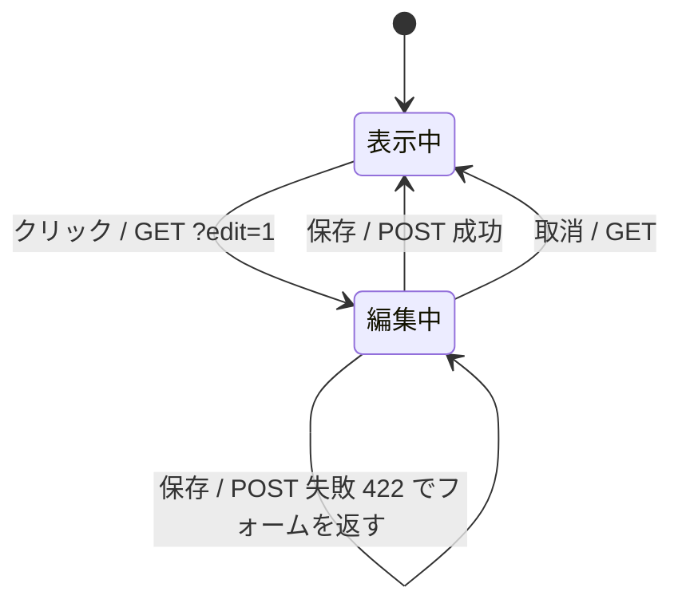

# 04. 実装パターン集

このアプリで使っている htmx のパターンを、**問題 → 解き方 → コード → 実物**の順で並べます。
上から順に難しくなります。写経するならこの順番がおすすめです。

---

## 目次

| # | パターン | 難易度 |
|---|---|---|
| [1](#1-ページ遷移を-ajax-化する) | ページ遷移を ajax 化する | ★ |
| [2](#2-csrf-トークンを全リクエストに付ける) | CSRF トークンを全リクエストに付ける | ★ |
| [3](#3-ライブ検索) | ライブ検索 | ★ |
| [4](#4-並べ替えとページング) | 並べ替えとページング | ★★ |
| [5](#5-ローディング表示と二重送信防止) | ローディング表示と二重送信防止 | ★ |
| [6](#6-モーダルで作成編集する) | モーダルで作成・編集する | ★★ |
| [7](#7-バリデーションエラーを返す2つの方式) | バリデーションエラーを返す2つの方式 | ★★ |
| [8](#8-トースト通知) | トースト通知 | ★★ |
| [9](#9-イベントで画面をまたいで更新する) | イベントで画面をまたいで更新する | ★★ |
| [10](#10-行を削除する) | 行を削除する | ★★ |
| [11](#11-クリックしてその場で編集) | クリックしてその場で編集 | ★★★ |
| [12](#12-入力中のリアルタイム検証) | 入力中のリアルタイム検証 | ★★ |
| [13](#13-連動プルダウン) | 連動プルダウン | ★★ |
| [14](#14-チェックボックスによる一括操作) | チェックボックスによる一括操作 | ★★ |
| [15](#15-out-of-band-swap) | Out of Band Swap | ★★★ |
| [16](#16-無限スクロール) | 無限スクロール | ★★ |
| [17](#17-ポーリング) | ポーリング | ★ |
| [18](#18-遅延ロード) | 遅延ロード | ★ |
| [19](#19-ドラッグドロップ) | ドラッグ&ドロップ | ★★★ |
| [20](#20-ファイルダウンロード) | ファイルダウンロード | ★ |

---

## 1. ページ遷移を ajax 化する

**問題**: 画面遷移のたびに CSS も JS も読み直され、体感が重い。

**解き方**: `<body>` に `hx-boost="true"` を書くだけ。以降すべての `<a>` と `<form>` が
ajax になり、`<body>` の中身だけ差し替わります。URL も履歴も正しく動きます。

```html
<!-- templates/base.html -->
<body hx-boost="true">
```

**除外したいとき**は `hx-boost="false"`。

```html
<a href="/companies/export/" hx-boost="false">⬇ CSV</a>   <!-- ダウンロード -->
<a href="mailto:x@example.com" hx-boost="false">メール</a>
<form method="post" action="/accounts/logout/" hx-boost="false">  <!-- セッション更新 -->
```

> **ログインフォームも除外**しています。ログイン成功時のリダイレクトと
> セッションの張り直しは、素の遷移に任せたほうが確実です。

---

## 2. CSRF トークンを全リクエストに付ける

**問題**: htmx の POST がすべて 403 になる。

**解き方**: htmx の属性は子要素に継承されるので、`<body>` に一度書けば全体に効きます。

```html
<!-- templates/base.html -->
<body hx-headers='{"X-CSRFToken": "{{ csrf_token }}"}'>
```

各フォームの `` は、素の POST（`hx-boost` 経由を含む）のために残します。

---

## 3. ライブ検索

**問題**: 検索ボタンを押させたくない。でも1文字打つたびに投げるのは重い。

**解き方**: `changed`（値が実際に変わったときだけ）と `delay:`（打ち終わってから）の2語。

```django
{# templates/crm/company_list.html #}
<form id="filters"
      hx-get=""
      hx-trigger="change, keyup changed delay:350ms, submit"
      hx-target="#results"
      hx-swap="outerHTML"
      hx-push-url="true"
      hx-include="#sort-state"
      hx-indicator="#list-spinner">
  <input type="search" name="q" value="{{ q }}" autocomplete="off">
  <select name="industry">…</select>
  <label><input type="checkbox" name="active_only" value="1"> 有効のみ</label>
</form>
```

**ポイント3つ**

1. **トリガーはフォームに1つ**。`change` も `keyup` も子からバブリングしてくる
2. **`<form>` に `hx-get`** を書くと、中の入力値が自動でクエリ文字列になる
3. **`hx-push-url="true"`** で URL も変わる。リロード・戻る・URL 共有がすべて成立する

ビュー側は「htmx なら断片、そうでなければフルページ」を返すだけです。

```python
# crm/views.py: company_list
queryset = Company.objects.with_stats().select_related("owner").search(keyword)
...
return render(request, partial(request, "crm/company_list.html", "results"), context)
```

**実物**: 取引先／担当者／商談一覧／活動履歴の検索窓

---

## 4. 並べ替えとページング

**問題**: 「検索条件は保ったまま、並び順だけ変えた URL」を作りたい。

**解き方**: Django 5.1 で入った `` タグ。`as` で変数に受ければ
`href` と `hx-get` の両方に使い回せます（htmx が無効でも動く＝段階的向上）。

```django

<th>
  <a href="{{ qs }}"
     hx-get="{{ qs }}"
     hx-target="#results" hx-swap="outerHTML" hx-push-url="true">
    会社名 
  </a>
</th>
```

ページングも同じ考え方です。

```django
<button hx-get=""
        hx-target="#results" hx-swap="outerHTML" hx-push-url="true">次へ →</button>
```

### 並び順を安全に受け取る

ユーザー入力をそのまま `order_by()` に渡すと、任意のカラムを覗かれます。
**必ずホワイトリスト**にします。

```python
# crm/views.py
COMPANY_SORTS = {"name": "name_kana", "industry": "industry", ...}

def sorted_queryset(request, queryset, allowed: dict[str, str], default: str):
    key = request.GET.get("sort", default)
    if key not in allowed:          # ← 知らないキーは既定値に落とす
        key = default
    field = allowed[key]
    descending = request.GET.get("dir") == "desc"
    return queryset.order_by(f"-{field}" if descending else field), key, descending
```

### 検索と並び順を両立させる小技

検索フォームは `#results` の外にあります（再描画でフォーカスを失わないため）。
一方、並び順の状態は `#results` の中にあります。そこで `hx-include` で拾います。

```django
{# 検索フォーム側 #}
<form id="filters" ... hx-include="#sort-state">

{# #results の中 #}
<div id="sort-state" hidden>
  <input type="hidden" name="sort" value="{{ sort_key }}">
  <input type="hidden" name="dir" value="descasc">
</div>
```

---

## 5. ローディング表示と二重送信防止

```html
<button hx-get="/guide/slow/"
        hx-target="#slow-result"
        hx-indicator="#slow-spinner"
        hx-disabled-elt="this">
  遅いAPIを呼ぶ
</button>
<span id="slow-spinner" class="htmx-indicator"><span class="spinner"></span> 待っています…</span>
```

CSS 側:

```css
.htmx-indicator { opacity: 0; transition: opacity .15s; }
.htmx-request .htmx-indicator,
.htmx-request.htmx-indicator { opacity: 1; }
```

一覧の差し替え中は、コンテナごとうっすら沈ませると「効いている感」が出ます。

```css
.htmx-request.dimmable { opacity: .45; }
```

**実物**: 「htmx ガイド」ページの「遅いAPIを呼ぶ」ボタン

---

## 6. モーダルで作成・編集する

**問題**: モーダルの開閉状態をどこが持つのか。

**解き方**: **持たない**。標準の `<dialog>` を空で置いておき、
中身が入った瞬間に開き、サーバから「閉じろ」と言われたら閉じます。

```html
<!-- templates/base.html : 最初は空 -->
<dialog id="modal"><div id="modal-body"></div></dialog>
```

```html
<!-- 開くボタン。中身を取ってくるだけ -->
<button hx-get="" hx-target="#modal-body">＋ 新規登録</button>
```

```js
// static/js/app.js : 中身が入ったら開く
document.body.addEventListener("htmx:afterSwap", (event) => {
  if (event.target.id === "modal-body" && !modal.open) modal.showModal();
});
// サーバから「閉じろ」と言われたら閉じる
document.body.addEventListener("closeModal", () => closeModal());
```

保存に成功したら、サーバは **本文なし（204）＋ ヘッダで指示** を返します。

```python
# crm/views.py: company_create
if request.method == "POST" and form.is_valid():
    company = form.save()
    response = HttpResponse(status=204)          # 差し替えるものは無い
    trigger_client_event(response, "closeModal", {})
    trigger_client_event(response, "companyListChanged", {})
    return toast(response, f"取引先「{company.name}」を登録しました")
```

> htmx は **204 のとき swap を行いません**。だから「閉じる」「一覧を更新」「トースト」を
> ヘッダだけで指示できます。

---

## 7. バリデーションエラーを返す2つの方式

このアプリでは**わざと2通り**実装してあります。読み比べてください。

### 方式A: 422 を返す（`crm/views.py: company_create`）

HTTP のセマンティクスとして正しい。ただし htmx はデフォルトで
4xx のレスポンスを画面に反映しないので、`response-targets` 拡張が要ります。

```python
status = 422 if request.method == "POST" else 200
return render(request, "crm/company_form.html", {...}, status=status)
```

```html
<body hx-ext="response-targets">
...
<form hx-post="{{ action }}"
      hx-target="#modal-body"
      hx-target-422="#modal-body">   <!-- 422 のときの行き先 -->
```

### 方式B: 常に 200 で返し直す（`crm/views.py: contact_create`）

拡張機能が要らないぶん手軽。多くのプロジェクトはこれで十分です。

```python
# 成功時だけ 204、それ以外は素直に 200 でフォームを返す
return render(request, "crm/contact_form.html", {"form": form, ...})
```

```html
<form hx-post="{{ action }}" hx-target="#modal-body" hx-swap="innerHTML">
```

### 方式C: htmx の設定で 422 も swap させる（拡張なし）

htmx 2 には `htmx.config.responseHandling` という設定があり、
**ステータスコードごとに swap するかどうか**を宣言できます。
既定値はこうなっています。

```js
htmx.config.responseHandling = [
  { code: "204",    swap: false },              // 本文なし → 差し替えない
  { code: "[23]..", swap: true  },              // 2xx / 3xx → 差し替える
  { code: "[45]..", swap: false, error: true }, // 4xx / 5xx → 差し替えない
];
```

配列は**先頭から順に評価され、最初にマッチしたもの**が使われます。
なので 422 の行を前に足せば、拡張機能なしで方式A と同じことができます。

```js
htmx.config.responseHandling = [
  { code: "204",    swap: false },
  { code: "422",    swap: true  },   // ← バリデーションエラーは差し替える
  { code: "[23]..", swap: true  },
  { code: "[45]..", swap: false, error: true },
];
```

ただし `hx-target-422` のような**行き先の出し分けはできません**
（通常の `hx-target` に入ります）。モーダルのように行き先が1つなら十分です。

> このアプリでは学習のため `response-targets` 拡張を使っていますが、
> 実務では方式C が最も依存が少なくて済むことが多いです。

### 3つの比較

| | 方式A（422 + 拡張） | 方式B（常に200） | 方式C（config） |
|---|---|---|---|
| HTTP 的な正しさ | ◎ | △ | ◎ |
| 追加ライブラリ | 拡張が必要 | 不要 | 不要 |
| コンソール | エラーとして記録される | きれい | エラーとして記録される |
| 行き先の出し分け | できる | — | できない |
| API 兼用 | しやすい | しにくい | しやすい |

---

## 8. トースト通知

**問題**: 保存できたことをどう知らせるか。JS に通知処理を書きたくない。

**解き方**: サーバは `HX-Trigger` ヘッダを返すだけ。
htmx がそれを `CustomEvent` に変換してくれます。

```python
# crm/views.py
def toast(response, message: str, level: str = "success"):
    return trigger_client_event(response, "toast", {"message": message, "level": level})
```

```js
// static/js/app.js
document.body.addEventListener("toast", (event) => {
  showToast(event.detail.message, event.detail.level || "success");
});
```

通常のページ遷移（Django messages）も同じトーストに流し込むと、
経路の違いをユーザーに意識させずに済みます。

```django
{# templates/base.html #}

<script>
  window.addEventListener("DOMContentLoaded", () => {
    
      window.showToast({{ message|escapejs|stringformat:'"%s"' }}, "{{ message.tags }}");
    
  });
</script>

```

---

## 9. イベントで画面をまたいで更新する

**問題**: モーダルで保存したら一覧を更新したい。でも
「モーダルが一覧を知っている」形にはしたくない。

**解き方**: サーバが**イベント名を投げ**、一覧は**自分で自分を更新**します。

```python
trigger_client_event(response, "companyListChanged", {})
```

```django
<div id="results"
     hx-get=""
     hx-trigger="companyListChanged from:body"
     hx-target="this"
     hx-swap="outerHTML">
```

`from:body` は「body で起きたイベントを拾う」の意味です。
htmx が発火させたイベントは発火元からバブリングして body に届きます。

この形にしておくと、あとから「CSV 取り込み」「一括操作」を足しても、
同じイベントを投げるだけで一覧は勝手に最新化されます。

> ⚠️ このパターンには**発火順の落とし穴**があります。
> [06. ハマりどころ](06-pitfalls.md#1-hx-trigger-のイベント発火順) を必ず読んでください。

---

## 10. 行を削除する

**空のレスポンス**を `outerHTML` で当てれば行が消えます。

```django
<button hx-delete=""
        hx-target="#company-row-{{ company.pk }}"
        hx-swap="outerHTML swap:300ms"
        hx-confirm="「{{ company.name }}」を削除します。よろしいですか？">🗑</button>
```

`swap:300ms` は「消える前に 300ms 待つ」指定です。その間 htmx が
`htmx-swapping` クラスを付けるので、CSS でフェードアウトさせられます。

サーバは呼び出し元によって返すものを変えます。

```python
# crm/views.py: company_delete
if request.htmx and request.headers.get("HX-Target", "").startswith("company-row-"):
    return toast(HttpResponse(""), f"「{name}」を削除しました", "warning")   # 行を消す
messages.warning(request, f"「{name}」を削除しました")
return HttpResponseClientRedirect("/companies/")                          # 一覧へ飛ばす
```

---

## 11. クリックしてその場で編集

**問題**: 「いま編集中かどうか」をどこが持つのか。

**解き方**: **持たない**。1つの URL が「表示用 HTML」と「編集フォーム」を出し分けます。



テンプレートには2つのパーシャルを置きます。どちらも
**自分自身（`closest .inline-edit`）を `outerHTML` で置き換える**のがミソです。

```django
{# templates/crm/company_detail.html #}

<div class="inline-edit" id="field-{{ field }}"
     hx-get="?edit=1"
     hx-target="this" hx-swap="outerHTML" hx-trigger="click">
  
  <span class="value">{{ display_value|default:"—" }}</span>
</div>



<div class="inline-edit" id="field-{{ field }}" data-inline-form>
  <form hx-post=""
        hx-target="closest .inline-edit" hx-swap="outerHTML"
        hx-target-422="closest .inline-edit">
    
    {{ f }}{{ f.errors }}
    <button type="submit">✓</button>
    <button type="button" data-cancel
            hx-get=""
            hx-target="closest .inline-edit" hx-swap="outerHTML">✕</button>
  </form>
</div>

```

ビューは3分岐だけです。

```python
# crm/views.py: company_inline_field
if field not in INLINE_EDITABLE_FIELDS["Company"]:   # ← ホワイトリスト必須
    return HttpResponseBadRequest(...)

if request.method == "POST":
    form = build_inline_form(company, field, data=request.POST)
    if form.is_valid():
        form.save()
        return toast(render(request, "...#inline-display", {...}), "保存しました")
    return render(request, "...#inline-form", {...}, status=422)

if request.GET.get("edit"):
    return render(request, "...#inline-form", {...})
return render(request, "...#inline-display", {...})
```

### 1フィールドだけのフォームを動的に作る

項目ごとにフォームクラスを書くのは面倒なので、`modelform_factory` で生成します。

```python
# crm/forms.py
INLINE_EDITABLE_FIELDS = {
    "Company": ["name", "phone", "website", "address", "employee_count", "rank", "note"],
    "Deal": ["title", "amount", "probability", "expected_close_date"],
}

def build_inline_form(instance, field_name: str, data=None):
    allowed = INLINE_EDITABLE_FIELDS.get(instance.__class__.__name__, [])
    if field_name not in allowed:
        raise ValueError(...)
    form_class = forms.modelform_factory(instance.__class__, form=_InlineBase, fields=[field_name])
    return form_class(data=data, instance=instance)
```

> **セキュリティ上の要点**: URL に項目名が入るので、
> ホワイトリストが無いと `is_active` や `owner` を書き換えられてしまいます。

**実物**: 取引先の詳細ページで電話番号やメモをクリック

---

## 12. 入力中のリアルタイム検証

**問題**: 送信してから「そのメールアドレスは使用済みです」と言われたくない。

**解き方**: 入力欄から専用エンドポイントを叩き、**判定結果の小さな HTML** だけ返します。

```django
{# templates/crm/contact_form.html #}
<input type="email" name="email"
       hx-get="/contacts/check-email/"
       hx-trigger="keyup changed delay:500ms, blur"
       hx-target="#email-feedback"
       hx-swap="outerHTML"
       hx-vals='{"pk": "{{ form.instance.pk|default:'' }}"}'>


  <div id="email-feedback" class="help">
    ✓ ✕ {{ message }}
  </div>

```

```python
# crm/views.py: contact_check_email
if owner := Contact.objects.filter(email__iexact=email).exclude(pk=exclude_pk).first():
    state, message = "error", f"{owner.company.name} の {owner.full_name} さんが使用中です"
```

> `hx-vals` で編集中レコードの pk を渡し、自分自身を重複判定から除外しています。
> **サーバ側の本来のバリデーション（`ContactForm.clean_email`）は残したまま**です。
> これは UX 向上のための先出しであって、検証の置き換えではありません。

---

## 13. 連動プルダウン

取引先を選んだら、担当者のプルダウンをその会社の人だけに絞ります。

```django
{# templates/crm/deal_form.html #}
<select name="company"
        hx-get="/contacts/options/"
        hx-target="#id_contact"
        hx-swap="innerHTML"
        hx-indicator="#contact-loading">
  …
</select>

<select name="contact" id="id_contact">
  
    <option value="">---------</option>
    
      <option value="{{ contact.pk }}">{{ contact.full_name }}</option>
    
  
</select>
```

サーバは `<option>` の並びだけを返します。

```python
# crm/views.py: contact_options
contacts = Contact.objects.filter(company_id=company_id) if company_id else Contact.objects.none()
return render(request, "crm/deal_form.html#contact-options", {"contacts": contacts})
```

**サーバ側の整合性チェックも忘れずに**（画面を細工されても壊れないように）。

```python
# crm/forms.py: DealForm.clean
if company and contact and contact.company_id != company.pk:
    self.add_error("contact", "担当者は選択した取引先に所属している必要があります。")
```

---

## 14. チェックボックスによる一括操作

`hx-include` で「チェックの入った行だけ」を集めて送ります。

```django
<button hx-post=""
        hx-vals='{"action":"rank_a"}'
        hx-include="#results input[name=selected]:checked"
        hx-swap="none">ランクAにする</button>
```

`hx-swap="none"` にしているのは、返ってくるのが 204 ＋ ヘッダだけだからです。
一覧の更新は [パターン9](#9-イベントで画面をまたいで更新する) のイベントに任せます。

```python
# crm/views.py: company_bulk_action
match action:
    case "rank_a":      queryset.update(rank=Company.Rank.A); label = f"{count} 件を…"
    case "deactivate":  queryset.update(is_active=False);     label = ...
    case "delete":      queryset.delete();                    label = ...
    case _:             return toast(HttpResponse(status=204), "不明な操作です", "error")

response = HttpResponse(status=204)
trigger_client_event(response, "companyListChanged", {})
return toast(response, label)
```

---

## 15. Out of Band Swap

**問題**: チェックを1つ付けただけで、「その行」と「サイドバーのバッジ」という
**離れた2箇所**を更新したい。

**解き方**: 返す HTML に `hx-swap-oob="true"` を付けた要素を混ぜておくと、
htmx が **id を頼りに勝手に差し替えて**くれます。

```django
{# templates/crm/task_list.html #}

            {# ← 通常の差し替え先 #}

  <span id="task-badge" class="count" hx-swap-oob="true">{{ open_count }}</span>

  <span id="task-badge" hx-swap-oob="true"></span>


```

```python
# crm/views.py: task_toggle
response = render(request, "crm/task_list.html#row-with-oob",
                  {"task": task, "open_count": Task.objects.needs_attention(request.user).count()})
```

> **バッジの定義は1か所に**。コンテキストプロセッサとこのビューで別々に数えると、
> リロードした瞬間に数字が変わる、という気持ち悪いバグになります。
> このアプリでは `Task.objects.needs_attention(user)` に寄せてあります。

**実物**: タスク一覧やダッシュボードでチェックを付けると、サイドバーの数字が同時に変わる

---

## 16. 無限スクロール

**解き方**: 最後の要素に `hx-trigger="revealed"`。スクロール監視のコードは書きません。

```django
{# templates/crm/activity_list.html #}

  
    <li 
          hx-get=""
          hx-trigger="revealed"
          hx-target="#activity-items"
          hx-swap="beforeend"
        >
      …
    </li>
  

```

ビューは「2ページ目以降は項目だけ返す」を判定します。

```python
# crm/views.py: activity_list
if request.htmx and request.GET.get("page"):
    return render(request, "crm/activity_list.html#items", context)   # <li> だけ
return render(request, partial(request, "crm/activity_list.html", "feed"), context)
```

読み込みマーカー用の要素を別に置かず、**最後の項目自体に載せている**のがコツです。
別要素にすると、追加されるたびに DOM に残骸が溜まります。

---

## 17. ポーリング

```django
<div id="kpi"
     hx-get=""
     hx-trigger="every 30s, dealListChanged from:body"
     hx-target="this" hx-swap="outerHTML">
```

WebSocket を持ち出すほどでもない画面は、まずこれで十分なことが多いです。
`every 30s` と カスタムイベントを併記すれば、「定期更新＋変更時は即座」になります。

止めたいときはサーバから HTTP 286 を返します。

```python
from django_htmx.http import HttpResponseStopPolling
return HttpResponseStopPolling()
```

---

## 18. 遅延ロード

重い集計を初期表示のブロッキング要因にしないパターン。

```django
<div class="card-body"
     hx-get=""
     hx-trigger="load"
     hx-swap="innerHTML">
  <div class="row muted small"><span class="spinner"></span> 集計中…</div>
</div>
```

中に書いたプレースホルダがそのままローディング表示になります。

---

## 19. ドラッグ&ドロップ

htmx は属性で書くのが基本ですが、ドラッグのような「JS 起点」の操作では
**JS から `htmx.ajax()` を呼びます**。

```js
// static/js/app.js
Sortable.create(list, {
  group: "deals",
  onEnd(event) {
    const card = event.item;
    const stage = event.to.dataset.stage;
    const order = Array.from(event.to.children).map((el) => el.dataset.dealId);
    htmx.ajax("POST", `/deals/${card.dataset.dealId}/move/`, {
      target: "#board", swap: "outerHTML",
      values: { stage, order },
    });
  },
});
```

サーバは**ボード全体を返し直します**。DOM はすでに動いていますが、
サーバの状態を正としてまるごと描き直すことで、集計値や表示順のズレを防げます。

```python
# crm/views.py: deal_move
deal.stage = stage
deal.probability = Deal.DEFAULT_PROBABILITY[stage]      # ステージに応じた確度を自動設定
deal.save(update_fields=["stage", "probability", "updated_at"])

Deal.objects.bulk_update(to_update, ["position"])       # 並び順を振り直す

Activity.objects.create(subject=f"ステージ変更: {previous} → {deal.get_stage_display()}", ...)
return toast(render(request, "crm/deal_board.html#board", board_context()), "…")
```

> ⚠️ **差し替え後は SortableJS を初期化し直す必要があります**。
> `htmx:afterSettle` で再初期化し、フラグで二重初期化を防ぎます。
> 詳細は [06. ハマりどころ](06-pitfalls.md#5-差し替え後のライブラリ再初期化)。

---

## 20. ファイルダウンロード

**htmx を通してはいけません**。ajax でバイナリを受け取っても保存できないからです。
素のリンクにします。

```django
<a class="btn" hx-boost="false" href="?q={{ q|urlencode }}">
  ⬇ CSV
</a>
```

`hx-boost` が body に効いているので、明示的に `false` にするのが必須です。

```python
# crm/views.py: company_export_csv
response = HttpResponse(content_type="text/csv; charset=utf-8-sig")   # Excel 対策の BOM
response["Content-Disposition"] = 'attachment; filename="companies.csv"'
```

> `utf-8-sig` にしているのは、Excel で開いたときの文字化けを防ぐためです。
