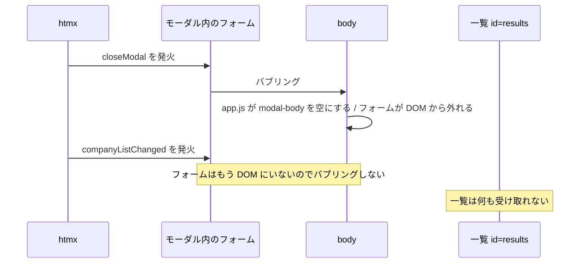
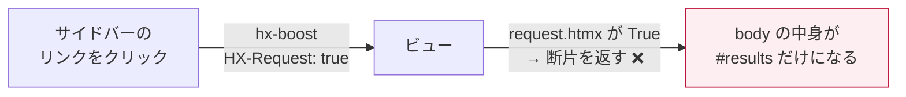

# 06. ハマりどころ

このアプリを作る過程で**実際に踏んだバグ**を、原因と直し方つきで残します。
どれも「動いてしまう」または「静かに壊れる」タイプなので、知っておくと時間が節約できます。

---

## 1. `HX-Trigger` のイベント発火順

### 症状

モーダルで保存すると、**モーダルは閉じるのに一覧が更新されない**。
コンソールにはエラーも出ない。

### 原因

サーバは3つのイベントをまとめて返しています。

```
HX-Trigger: {"closeModal": {}, "companyListChanged": {}, "toast": {...}}
```

htmx はこれを **リクエストを出した要素の上で、JSON の順に** 発火させます。
その要素は「モーダルの中のフォーム」です。



`closeModal` を受けた瞬間に `innerHTML = ""` すると、**フォームが DOM から切り離され、
残りのイベントが body まで届かなくなります**。

### 直し方

片付けを次のタスクに回して、同期的な切断を避けます。

```js
// static/js/app.js
function clearModalLater() {
  setTimeout(() => {
    const body = document.getElementById("modal-body");
    if (body && !modal.open) body.innerHTML = "";
  }, 0);
}
```

> **教訓**: `HX-Trigger` で複数イベントを返すときは、
> 「先のイベントのハンドラが DOM を壊さないか」を必ず確認する。

---

## 2. `hx-disabled-elt` が子要素に継承される

### 症状

コンソールに大量のエラー。

```
The selector "find button[type=submit]" on hx-disabled-elt returned no matches!
```

### 原因

**htmx の属性は子要素に継承されます**。これは `hx-headers` を body に1回書くだけで
全リクエストに CSRF が付く、という便利さの裏返しです。

```html
<form hx-post="…" hx-disabled-elt="find button[type=submit]">
  <!-- ⚠️ この input は自分でリクエストを出す。
       継承した hx-disabled-elt を自分基準で解決しようとして失敗する -->
  <input name="email" hx-get="/contacts/check-email/" hx-trigger="keyup changed delay:500ms">
  <button type="submit">保存</button>
</form>
```

`find` は「**自分の子孫**から探す」なので、`<input>` を起点にすると何も見つかりません。

### 直し方

`hx-disinherit` で、この属性だけ継承を止めます。

```html
<form hx-post="…"
      hx-disabled-elt="find button[type=submit]"
      hx-disinherit="hx-disabled-elt">
```

> **教訓**: フォームの中に「自分でリクエストを出す要素」があるときは、
> 継承させたくない属性を `hx-disinherit` で明示する。

---

## 3. `hidden` 属性は `display:flex` に負ける

### 症状

一括操作バーが `hidden` を付けているのに常に表示される。

### 原因

ブラウザ標準のスタイルは `[hidden] { display: none }` ですが、
これは**詳細度の低いルール**です。自分で書いた `.row { display: flex }` が勝ちます。

```html
<div id="bulk-bar" class="card card-body row" hidden>  <!-- .row が display:flex -->
```

### 直し方

```css
[hidden] { display: none !important; }
```

> **教訓**: `hidden` 属性で出し分けるなら、CSS で1行守っておく。
> ユーティリティクラスで `display` を当てる設計では必ず起きる。

---

## 4. `{# … #}` は複数行に書けない

### 症状

コメントのつもりの文章が、**そのまま画面に表示される**。

### 原因

Django の `{# … #}` は**1行コメント専用**です。改行をまたぐと、
テンプレートエンジンはコメントとして認識せず、ただのテキストとして出力します。

```django
{#
  この3行は
  コメントにならず
  そのまま表示される
#}
```

### 直し方

複数行は必ず `` を使います。

```django

  こちらは正しくコメントになる

```

> **教訓**: エラーにならず「表示されるだけ」なので、レビューで見落としやすい。
> `grep -rn "{#" templates/ | grep -v "#}"` で機械的に検出できる。

---

## 5. 差し替え後のライブラリ再初期化

### 症状

カンバンを1回ドラッグすると動くが、**2回目からドラッグできない**。

### 原因

サーバがボード全体を返して差し替えるので、SortableJS がインスタンスを
紐づけていた DOM ノードが丸ごと消えます。

### 直し方

`htmx:afterSettle` で初期化し直します。ただし**フラグで二重初期化を防ぐ**こと。

```js
function initSortable() {
  document.querySelectorAll(".board-list").forEach((list) => {
    if (list.dataset.sortableReady) return;   // ← これが無いと多重にバインドされる
    list.dataset.sortableReady = "1";
    Sortable.create(list, { … });
  });
}
document.addEventListener("DOMContentLoaded", initSortable);
document.body.addEventListener("htmx:afterSettle", initSortable);
```

> **教訓**: htmx と JS ライブラリを併用するときは、
> 「差し替えられたら初期化し直す」を必ずセットで書く。
> `afterSwap` ではなく `afterSettle` を使うのは、DOM が落ち着いてからのほうが安全なため。

---

## 6. `CheckboxSelectMultiple` も `input_type` が `"checkbox"`

### 症状

タグの複数選択チェックボックスが、**まるごと1つの `<label>` に飲み込まれる**。

### 原因

フォーム項目を共通テンプレートで描くとき、こう書きたくなります。

```django

  <label>{{ field }} {{ field.label }}</label>     {# 単体チェックボックス用 #}

  …

```

ところが `CheckboxSelectMultiple` も `input_type` は `"checkbox"` です。
結果、チェックボックス群 5 個ぜんぶが `<label>` の中に入り、レイアウトが崩れます。

### 直し方

**複数選択の判定を先に置く**。

```django

  <label>{{ field.label }}</label>
  <div class="checkbox-list">{{ field }}</div>

  <label>{{ field }} {{ field.label }}</label>

  …

```

参考: Django の `CheckboxSelectMultiple` は `<div><div><label>…` という構造で出力されます。
CSS を当てるときはこの入れ子を前提にします。

```css
.checkbox-list > div { display: flex; flex-wrap: wrap; gap: 6px 14px; }
```

---

## 7. 開発中に CSS / JS が更新されない

### 症状

CSS を直したのに反映されない。サーバ側は新しいファイルを配信している。

### 原因

ブラウザのキャッシュ。開発サーバは `Last-Modified` を返しますが、
ブラウザは条件付きリクエストすら投げないことがあります。

### 直し方

`DEBUG=True` のときだけ、ファイルの更新時刻をクエリに付けます。

```python
# crm/context_processors.py
def asset_version(request):
    if not settings.DEBUG:
        return {"asset_v": ""}       # 本番は ManifestStaticFilesStorage に任せる
    newest = max(p.stat().st_mtime
                 for d in settings.STATICFILES_DIRS
                 for p in d.rglob("*") if p.suffix in {".css", ".js"} and p.is_file())
    return {"asset_v": f"?v={int(newest)}"}
```

```django
<link rel="stylesheet" href="{{ asset_v }}">
<script src="{{ asset_v }}" defer></script>
```

---

## 8. htmx はエラーを画面に出さない

### 症状

ボタンを押しても何も起きない。ユーザーには成功したように見える。

### 原因

htmx は **4xx / 5xx のレスポンスをデフォルトで swap しません**。
つまり、サーバが 500 を返しても画面は無反応です。

### 直し方

**必ず** グローバルなエラーハンドラを書きます。

```js
// static/js/app.js
document.body.addEventListener("htmx:responseError", (event) => {
  const status = event.detail.xhr.status;
  if (status === 422) return;                      // バリデーションは別処理
  if (status === 403) { showToast("権限がありません（セッション切れかも）", "error"); return; }
  showToast(`エラーが発生しました (HTTP ${status})`, "error");
});

document.body.addEventListener("htmx:sendError", () => {
  showToast("サーバに接続できませんでした", "error");
});
```

---

## 9. インライン編集の項目名をホワイトリストにする

### 症状（放置した場合）

`/companies/1/field/is_active/` を直接叩かれると、意図しない項目を書き換えられます。
URL に項目名が入る設計なので、**必ず起きうる**攻撃です。

### 直し方

```python
# crm/forms.py
INLINE_EDITABLE_FIELDS = {
    "Company": ["name", "phone", "website", "address", "employee_count", "rank", "note"],
    "Deal": ["title", "amount", "probability", "expected_close_date"],
}
```

```python
# crm/views.py
if field not in INLINE_EDITABLE_FIELDS["Company"]:
    return HttpResponseBadRequest("この項目はインライン編集できません")
```

テストでも守ります（`crm/tests.py: InlineEditTests`）。

```python
def test_許可されていないフィールドは400になる(self):
    url = reverse("crm:company_inline_field", args=[self.company.pk, "is_active"])
    self.assertEqual(self.client.get(url, {"edit": "1"}, **HTMX).status_code, 400)
```

---

## 10. バッジの数え方が2箇所にあるとズレる

### 症状

チェックを付けるとサイドバーの数字が `1` になるが、リロードすると消える。

### 原因

コンテキストプロセッサとトグル用ビューで、**別々の条件で数えていた**。

```python
# 片方は「期限が今日以前の未完了」
Task.objects.filter(assignee=user, is_done=False, due_date__lte=today).count()
# もう片方は「未完了すべて」
Task.objects.filter(assignee=user, is_done=False).count()
```

### 直し方

定義を QuerySet に寄せて、両方から呼びます。

```python
# crm/models.py
class TaskQuerySet(models.QuerySet):
    def needs_attention(self, user):
        return self.filter(assignee=user, is_done=False, due_date__lte=timezone.localdate())
```

> **教訓**: htmx で「画面の一部だけ更新」を始めると、
> 同じ数字を複数の経路で計算する場面が増える。定義は必ず1か所に。

---

## 11. 無限スクロールのローディング表示が溜まる

### やりがちな書き方

```django

  <li>…</li>
  
    <li class="htmx-indicator">読み込み中…</li>   {# ⚠️ 追加のたびに DOM に残る #}
  

```

`beforeend` で継ぎ足すので、この `<li>` はページごとに1つずつ蓄積します。
`htmx-indicator` は通常時 `opacity: 0` なので**見えないまま増え続ける**のが厄介です。

### 直し方

読み込みマーカーを別要素にせず、**最後の項目自体に `hx-trigger="revealed"` を載せる**。

```django
<li 
      hx-get="…?page={{ page_obj.next_page_number }}"
      hx-trigger="revealed" hx-target="#activity-items" hx-swap="beforeend"
    >
```

---

---

## 12. hx-boost のページ遷移も「htmx リクエスト」として届く

### 症状

サイドバーのリンクを押すと、**画面のレイアウトが丸ごと消える**。
URL は正しく変わり、一覧の中身も出ているのに、サイドバーもヘッダも無い。

### 原因

`hx-boost` によるページ遷移も `HX-Request: true` を送ってきます。
そのため `request.htmx` だけで分岐すると、**ページ遷移なのに断片を返して**しまいます。
htmx は返ってきた HTML で `<body>` の中身を丸ごと置き換えるので、
レイアウトごと断片に置き換わります。



### 直し方

`HX-Boosted` ヘッダ（django-htmx では `request.htmx.boosted`）で見分けます。

```python
def partial(request, template: str, name: str) -> str:
    if request.htmx and not request.htmx.boosted:
        return f"{template}#{name}"
    return template
```

回帰テストも忘れずに。

```python
BOOSTED = {"HTTP_HX_REQUEST": "true", "HTTP_HX_BOOSTED": "true"}

def test_boost経由ならフルページを返す(self):
    response = self.client.get(reverse("crm:company_list"), **self.BOOSTED)
    self.assertContains(response, "<!doctype html>")
    self.assertContains(response, 'class="sidebar"')
```

> **教訓**: `request.htmx` は「htmx が出したリクエストか」であって
> 「部分更新か」ではない。`hx-boost` を使うなら必ず `boosted` も見ること。
> このバグは E2E テストで初めて見つかった（結合テストは
> `HX-Boosted` を送っていなかったので素通りしていた）。

---

## 13. `charset=utf-8-sig` にすると行ごとに BOM が付く

### 症状

Excel で CSV を開くと、2行目以降の先頭列に見えない文字が入る。

### 原因

```python
response = HttpResponse(content_type="text/csv; charset=utf-8-sig")
writer = csv.writer(response)
writer.writerow([...])   # ← ここで BOM
writer.writerow([...])   # ← ここでも BOM
```

`HttpResponse.write()` は**呼ばれるたびに** `content_type` の charset で
エンコードします。`utf-8-sig` は「エンコードするたびに BOM を付ける」コーデックなので、
`csv.writer` が行ごとに `write()` する構造と噛み合いません。

### 直し方

BOM は自分で1回だけ書きます。

```python
response = HttpResponse(content_type="text/csv; charset=utf-8")
response.write("\ufeff")     # Excel 向けの BOM。ここで1回だけ
writer = csv.writer(response)
```

テストで固定します。

```python
def test_BOMは先頭に1回だけ(self):
    body = self.export().content
    self.assertTrue(body.startswith(b"\xef\xbb\xbf"))
    self.assertEqual(body.count(b"\xef\xbb\xbf"), 1)
```

---

## 14. ドラッグの並び順に `undefined` が混ざる

### 症状

**空の列**にカードを落とすと 500 エラー。カードのある列に落とす分には問題ない。

### 原因

空の列には「ここにドラッグ」というプレースホルダの `<div>` が入っています。

```js
const order = Array.from(event.to.children).map((el) => el.dataset.dealId);
// → ["undefined", "3"] のような配列になる
```

サーバ側で `int("undefined")` が `ValueError` を投げます。

```python
by_id = Deal.objects.in_bulk([int(i) for i in ordered_ids if i.isdigit()])
for index, raw_id in enumerate(ordered_ids):
    if (obj := by_id.get(int(raw_id))) is not None:   # ← ここで落ちる
```

`in_bulk` の側では `isdigit()` で弾いていたのに、ループの側で忘れていました。

### 直し方

両側で守ります。

```js
// カード要素だけを拾う
const order = Array.from(event.to.querySelectorAll(".deal-card"))
  .map((el) => el.dataset.dealId);
```

```python
# クライアントから届く値は信用しない。先に落としておく
ordered_ids = [i for i in request.POST.getlist("order") if i.isdigit()]
```

> **教訓**: フィルタは「1か所で先に」やる。同じ条件を2か所に書くと、片方を忘れる。
> そして、クライアントから届く配列は**必ず**検証すること。

---

## 15. Playwright の `fill()` は `keyup` を発火しない

E2E を書き始めると必ず踏みます。詳細は [07. テスト](07-testing.md#4-e2e-で踏んだ-playwright-の落とし穴) に
まとめてありますが、要点だけ:

| やりたいこと | 使うメソッド |
|---|---|
| `hx-trigger="change"` を発火させたい | `fill()` でよい（`change` は出る）… **ではない**。`fill()` は `input` のみ |
| `hx-trigger="keyup ..."` を発火させたい | `press_sequentially("文字列", delay=30)` |
| `<select>` を変えたい | `select_option()`（`change` が出る） |

**ライブ検索のテストは1文字ずつ打つ。** そのほうが実際のユーザーにも近い動きです。

---

## 16. その他、よくある詰まり

| 症状 | 原因 | 対処 |
|---|---|---|
| POST がすべて 403 | CSRF | `body` に `hx-headers='{"X-CSRFToken": "{{ csrf_token }}"}'` |
| 検索でフォーカスが外れる | 検索欄ごと差し替えている | 検索フォームを差し替え範囲の**外**に置く |
| 戻るボタンで壊れる | `hx-push-url` を付けていない／断片しか返せない URL | URL 単体でフルページも返せるようにする |
| CSV が開けない | htmx 経由でダウンロードしている | `hx-boost="false"` の素のリンクに |
| Excel で文字化け | BOM なし UTF-8 | `content_type="text/csv; charset=utf-8-sig"` |
| ポーリングが止まらない | 画面遷移後も動く | 要素が消えれば自動で止まる。明示的に止めるなら HTTP 286 |
| `hx-target` が効かない | セレクタのタイプミス | コンソールに `targetError` が出る。必ず見る |
