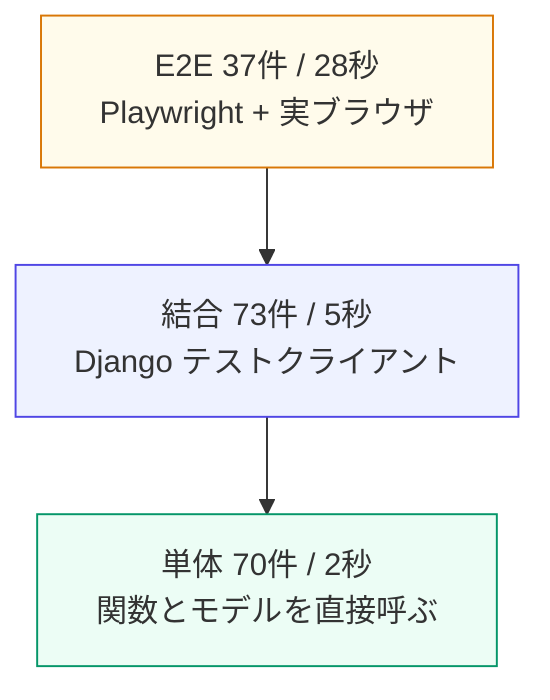
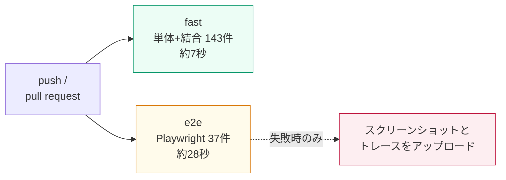

# 07. テスト — 単体・結合・E2E

このプロジェクトのテストは **180 件**、3つの層に分かれています。

```bash
uv run python manage.py test
```

| 層 | 場所 | 件数 | 所要 | 何を守るか |
|---|---|---:|---:|---|
| **単体** | `crm/tests/test_models.py`<br>`test_forms.py`<br>`test_templatetags.py` | 70 | 約 2 秒 | ドメインのロジック。HTTP もテンプレートも介さない |
| **結合** | `crm/tests/test_views.py`<br>`test_htmx.py` | 73 | 約 5 秒 | URL → ミドルウェア → ビュー → テンプレート。ブラウザは使わない |
| **E2E** | `e2e/test_smoke.py`<br>`test_interactions.py`<br>`test_dragdrop.py` | 37 | 約 28 秒 | 実ブラウザ。JavaScript が絡む部分だけ |



**方針は「下の層で済むことは下でやる」。**
E2E は遅く、壊れやすく、失敗の原因が分かりにくいので、
「実ブラウザでしか確かめられないこと」だけに絞ります。

```bash
uv run python manage.py test --exclude-tag=e2e
```

開発中はこれ（7 秒）を回し、コミット前に全部（35 秒）を回す、という運用が現実的です。

---

## 1. 単体テスト — ドメインのロジック

### 1-1. DB すら要らないものは、インスタンスを組み立てるだけ

`Deal(...)` は `save()` しなければ DB に触りません。計算プロパティのテストはこれで足ります。

```python
class DealPropertyTests(TestCase):
    def test_加重金額は金額かける確度(self):
        deal = Deal(amount=Decimal("1000000"), probability=35)
        self.assertEqual(deal.weighted_amount, Decimal("350000"))

    def test_期限超過は進行中の商談だけ(self):
        yesterday = timezone.localdate() - timedelta(days=1)
        self.assertTrue(Deal(stage="proposal", expected_close_date=yesterday).is_overdue)
        self.assertFalse(Deal(stage="won", expected_close_date=yesterday).is_overdue)  # 受注済み
        self.assertFalse(Deal(stage="proposal", expected_close_date=None).is_overdue)  # 予定日なし
```

### 1-2. QuerySet メソッドを直接テストする

検索条件をモデル層に寄せておくと、ビューを経由せずに試せます。

```python
def test_空文字なら素通しする(self):
    """呼び出し側に if を書かせないための仕様。"""
    self.assertEqual(Company.objects.search("").count(), Company.objects.count())
```

### 1-3. N+1 をクエリ数で固定する

htmx で一覧を頻繁に叩くようになると、N+1 の影響が大きくなります。
**発行クエリ数そのものをテストに書いて**しまうのが確実です。

```python
def test_一覧の集計はクエリ1本で済む(self):
    with self.assertNumQueries(1):
        for company in Company.objects.with_stats().select_related("owner"):
            _ = (company.contact_count, company.open_deal_amount, company.owner)
```

ビューにも同じ発想で置いてあります。増えたら気づけます。

```python
def test_一覧の発行クエリ数を抑える(self):
    with self.assertNumQueries(6):
        self.client.get(reverse("crm:company_list"))
```

> 内訳はセッション取得・ユーザー取得・件数カウント・サイドバーのバッジ2本・本体。
> 数字が変わったら「なぜ増えたか」を必ず確かめてから書き換えること。

### 1-4. DB レベルの制約もテストする

アプリのバリデーションは、管理コマンドや直接 SQL をすり抜けます。

```python
def test_会社名は大文字小文字を区別せず一意(self):
    with self.assertRaises(IntegrityError), transaction.atomic():
        Company.objects.create(name="テスト商事")
```

> `transaction.atomic()` で囲まないと、以降のクエリがすべて壊れます。

### 1-5. フォームは HTTP を介さずに試せる

`ModelForm` は辞書を渡すだけでテストできます。ビュー経由より速く、原因も分かりやすい。

```python
def test_自分自身は重複判定から除外する(self):
    """編集時に名前を変えずに保存できないと困る。"""
    form = CompanyForm(data={"name": "テスト商事", ...}, instance=self.company)
    self.assertTrue(form.is_valid(), form.errors)
```

`self.assertTrue(form.is_valid(), form.errors)` のように
**第2引数に `form.errors` を渡す**と、失敗時に理由が出ます。必ず付けてください。

### 1-6. 防御が何層あるかを明示する

書いていて気づいたのですが、商談フォームの「取引先違いの担当者」は
2層で守られていて、実際に効いているのは1層目でした。

```python
def test_取引先に所属しない担当者は弾く(self):
    """1層目: ModelChoiceField の queryset（取引先で絞ってある）
       2層目: clean() の突き合わせ
       実際に効くのは1層目なので、エラーメッセージも Django 標準のものになる。"""
    form = DealForm(data=self.base_data(contact=other_contact.pk))
    self.assertFalse(form.is_valid())
    self.assertIn("contact", form.errors)

def test_querysetを広げてもcleanが取引先違いを弾く(self):
    """2層目が実際に機能することを、1層目を無効化して確かめる。"""
    form = DealForm(data=self.base_data(contact=other_contact.pk))
    form.fields["contact"].queryset = Contact.objects.all()   # 1層目を無効化
    self.assertFalse(form.is_valid())
    self.assertIn("所属している必要があります", form.errors["contact"][0])
```

> **`ModelChoiceField` の queryset はセキュリティの境界です。**
> 「選択肢に無い値は弾かれる」ことに、意識的に頼ってください。

---

## 2. 結合テスト — ビューを HTTP レベルで

Django のテストクライアントは URL 解決からテンプレート描画までを通します。
ブラウザは使わないので **JavaScript は動きません**。そこが E2E との境界です。

### 2-1. htmx リクエストを再現する

```python
HTMX = {"HTTP_HX_REQUEST": "true"}

response = self.client.get(reverse("crm:company_list"), **HTMX)
```

`HX-Target` を見て挙動を変えるビューには、それも渡します。

```python
response = self.client.delete(url, HTTP_HX_TARGET=f"company-row-{pk}", **HTMX)
```

### 2-2. いちばん大事: 「断片が断片であること」

htmx 対応でいちばん壊れやすいのは、**うっかりフルページを返すこと**です。
レイアウトごと `#results` に差し込まれて、画面が入れ子になります。

```python
def test_一覧はhtmxだとレイアウトを含まない(self):
    full = self.client.get(reverse("crm:company_list"))
    self.assertContains(full, "<!doctype html>")

    fragment = self.client.get(reverse("crm:company_list"), **HTMX)
    self.assertNotContains(fragment, "<!doctype html>")
    self.assertNotContains(fragment, "<body")
    self.assertContains(fragment, 'id="results"')
```

**フルページ側と断片側は必ずペアで**確認します。

### 2-3. 断片が「もう一度更新できる」ことも見る

`outerHTML` で差し替えるので、返す断片自身が `hx-*` を持っていないと 2 回目が動きません。

```python
def test_断片にも更新用の属性が残っている(self):
    fragment = self.client.get(reverse("crm:company_list"), **HTMX)
    self.assertContains(fragment, "hx-get=")
    self.assertContains(fragment, "companyListChanged from:body")
```

### 2-4. レスポンスヘッダを検証する

htmx では「何を返したか」より「**どんな指示を出したか**」が重要な場面があります。

```python
def triggers(response) -> dict:
    """HX-Trigger は JSON。日本語は \\uXXXX にエスケープされるので、
    文字列の in で比較すると必ず失敗する。必ずパースすること。"""
    return json.loads(response["HX-Trigger"])


def test_保存成功は204とヘッダで指示する(self):
    response = self.client.post(reverse("crm:company_create"), {...}, **HTMX)
    self.assertEqual(response.status_code, 204)
    self.assertEqual(response.content, b"")

    payload = triggers(response)
    self.assertIn("closeModal", payload)
    self.assertIn("companyListChanged", payload)
    self.assertIn("新規会社", payload["toast"]["message"])
```

**イベントの順序も固定します。** 順序が変わると壊れる箇所があるからです。

```python
def test_イベントの順序が意図どおり(self):
    self.assertEqual(list(triggers(response)), ["closeModal", "companyListChanged", "toast"])
```

### 2-5. 「イベント名の契約」をテストで結ぶ

サーバが投げるイベント名と、一覧側の `hx-trigger` は**両者の契約**です。
どちらか片方だけ変えると、静かに更新されなくなります。

```python
def test_サーバが投げるイベントを一覧が待ち受けている(self):
    created = self.client.post(reverse("crm:company_create"), data, **HTMX)
    self.assertIn("companyListChanged", triggers(created))

    listing = self.client.get(reverse("crm:company_list"), **HTMX)
    self.assertContains(listing, "companyListChanged from:body")
```

疎結合にした代償として「繋がっていることを誰も保証しない」状態になるので、
**テストで結び直します**。

### 2-6. 422 と 200、2つの方式を別々に

```python
def test_方式A_バリデーションエラーは422(self):
    response = self.client.post(...)
    self.assertEqual(response.status_code, 422)
    self.assertContains(response, "すでに登録されています", status_code=422)
```

> `assertContains` は既定で 200 を期待します。
> **`status_code=422` を明示**しないとステータス不一致で落ちます。

### 2-7. 権限の穴を機械的に洗い出す

htmx を使うと入口が増えます。`login_required` の付け忘れは `subTest` で一括確認します。

```python
def test_保護されている画面を洗い出す(self):
    urls = [reverse("crm:dashboard"), ..., reverse("crm:company_inline_field", args=[pk, "phone"])]
    for url in urls:
        with self.subTest(url=url):
            self.assertEqual(self.client.get(url).status_code, 302)
```

---

## 3. E2E テスト — Playwright

### 3-1. 準備

```bash
uv add --dev playwright
```

```bash
uv run playwright install chromium
```

Chromium 本体（約 95MB）がダウンロードされます。初回だけです。

### 3-2. 土台（`e2e/base.py`）

`pytest` は使わず、**Django の標準テストランナーだけ**で動かしています。
コマンドが1つで済み、DB のセットアップも Django に任せられます。

```python
@tag("e2e")
class PlaywrightTestCase(StaticLiveServerTestCase):
    @classmethod
    def setUpClass(cls):
        # Playwright の同期 API は、Django が張るイベントループの中では動かない。
        # このフラグで「非同期文脈での同期呼び出し」を許可する。
        os.environ.setdefault("DJANGO_ALLOW_ASYNC_UNSAFE", "1")
        super().setUpClass()
        cls._pw = sync_playwright().start()
        cls.browser = cls._pw.chromium.launch()

    @classmethod
    def tearDownClass(cls):
        cls.browser.close()
        cls._pw.stop()
        super().tearDownClass()
```

`StaticLiveServerTestCase` は実際に HTTP サーバを別スレッドで起動し、
**静的ファイル（htmx 本体を含む）も配信**してくれます。

`@tag("e2e")` を付けておくと `--exclude-tag=e2e` で外せます。

### 3-3. ログインは画面を経由しない

ログイン画面の操作は1回テストすれば十分で、毎回フォームを埋めるのは無駄に遅いです。

```python
def login(self, user):
    session = SessionStore()
    session[SESSION_KEY] = str(user.pk)
    session[BACKEND_SESSION_KEY] = settings.AUTHENTICATION_BACKENDS[0]
    session[HASH_SESSION_KEY] = user.get_session_auth_hash()
    session.create()
    self.context.add_cookies([{
        "name": settings.SESSION_COOKIE_NAME,
        "value": session.session_key,
        "url": self.live_server_url,
    }])
```

### 3-4. コンソールエラーをテストの一部にする

**htmx は失敗を黙って握りつぶします。** セレクタのタイプミスなどはコンソールにしか出ません。
そこで「エラーが出ていないこと」自体を検証します。

```python
self.page.on("console", lambda msg:
    self.console_errors.append(msg.text) if msg.type == "error" else None)
self.page.on("pageerror", lambda err: self.console_errors.append(str(err)))

def assert_no_console_errors(self):
    self.assertEqual(self.console_errors, [], "コンソールにエラーが出ています")
```

これで実際に `hx-disabled-elt` の継承事故を検出できました。

### 3-5. `expect()` を使う — `sleep` は書かない

Playwright の `expect()` は**条件を満たすまでポーリング**します。
デバウンス 350ms でも、通信が遅くても、待ち時間を手で調整する必要はありません。

```python
def test_入力すると一覧が絞り込まれる(self):
    self.goto("/companies/")
    rows = self.page.locator("#results tbody tr")
    expect(rows).to_have_count(2)

    self.type_into(self.page.get_by_placeholder("会社名・カナ・住所で検索…"), "ベータ")

    expect(rows).to_have_count(1)          # ← 満たされるまで待つ
    expect(rows.first).to_contain_text("ベータ工業")
```

---

## 4. E2E で踏んだ Playwright の落とし穴

### ⚠️ `fill()` は `keyup` を発火しない

これに気づかないと「ライブ検索が動かない」と悩みます。

```python
locator.fill("ベータ")            # → input イベントだけ
locator.press_sequentially("ベータ", delay=30)   # → keydown / keypress / keyup
```

`hx-trigger="keyup changed delay:350ms"` で待ち受けている以上、
テストも **1文字ずつ打ち込む**べきです（そのほうが実際のユーザーに近い）。

```python
def type_into(self, locator, text):
    locator.click()
    locator.fill("")
    locator.press_sequentially(text, delay=30)
```

### ⚠️ 「DOM に現れた」と「htmx が処理し終えた」は別

htmx は `innerHTML` を差し替えてから、中の要素に属性を紐づけます。
中の `<select>` の存在だけを待って操作すると、`change` イベントが
**まだリスナーの無い要素に飛んで、静かに失われます**。

```python
# ❌ 要素の存在だけ待つ
expect(self.page.locator("#id_contact option")).to_have_count(1)
self.page.locator("select[name=company]").select_option(...)   # 失われることがある

# ✅ htmx の処理完了まで待つ
def open_modal(self, button_name):
    self.page.get_by_role("button", name=button_name).click()
    modal = self.page.locator("dialog#modal")
    expect(modal).to_be_visible()   # dialog を開くのは htmx:afterSwap ハンドラ
    return modal
```

`dialog` が visible になるのは `app.js` の `htmx:afterSwap` の中なので、
**これを待てば htmx の処理が済んでいることまで保証できます**。

### ⚠️ `confirm()` は自動で却下される

Playwright は既定でダイアログを dismiss します。明示的に受けてください。

```python
self.page.on("dialog", lambda dialog: dialog.accept())    # OK を押す
self.page.on("dialog", lambda dialog: dialog.dismiss())   # キャンセルを押す
```

### ⚠️ SortableJS はネイティブ DnD だとマウス操作で動かない

SortableJS は既定で HTML5 の drag-and-drop を使いますが、
Playwright のマウスイベントではこれが発火しません。

```js
Sortable.create(list, {
  forceFallback: true,      // SortableJS 自身の実装（ポインタイベント）を使う
  fallbackTolerance: 3,
});
```

これは**テストのためだけの妥協ではありません**。

- タッチ端末でも同じ挙動になる
- `dragClass` のスタイル（傾き・影）がブラウザ差なく効く
- E2E から操作できる

ドラッグは「1回で飛ばす」と認識されないので、段階的に動かします。

```python
self.page.mouse.move(sx, sy)
self.page.mouse.down()
self.page.wait_for_timeout(50)
for ratio in (0.2, 0.4, 0.6, 0.8, 1.0):
    self.page.mouse.move(sx + (tx - sx) * ratio, sy + (ty - sy) * ratio, steps=6)
    self.page.wait_for_timeout(30)
self.page.mouse.up()
```

### ⚠️ `to_have_url()` に関数は渡せない

文字列か正規表現だけです。

```python
expect(self.page).to_have_url(re.compile(r"q=%E3%83%99"))
```

---

## 5. E2E に置くべきもの / 置くべきでないもの

**E2E にしか書けないもの**（このプロジェクトで実際に置いているもの）

| テスト | なぜ E2E でないと無理か |
|---|---|
| モーダルを保存 → 閉じる → トースト → 一覧更新 | `HX-Trigger` の**発火順**の問題は、ヘッダを見ても分からない |
| ライブ検索 → URL 変化 → リロード → 戻る | ブラウザ履歴の挙動 |
| インライン編集の往復（3回連続） | 差し替えた断片に `hx-*` が残っているかは実際に押さないと分からない |
| チェック → 行とサイドバーが同時に変わる | OOB が本当に届いたか |
| スクロール → 追加読み込み | `revealed` はスクロールイベントが要る |
| ドラッグ&ドロップ → 再度ドラッグ | ライブラリの再初期化 |
| `hx-boost` の遷移でページがリロードされない | `window.__survived` が生き残るかで判定 |

**E2E に置いてはいけないもの**

- ステータスコードやヘッダの検証 → 結合テスト
- バリデーションメッセージの文言 → 単体テスト（フォーム）
- 権限や 404 の網羅 → 結合テスト
- 集計の計算結果 → 単体テスト

E2E は 1 件あたり約 0.8 秒。**37 件で 28 秒**です。
100 件を超えると誰も回さなくなるので、増やすときは
「これは本当に下の層で書けないか」を毎回問い直してください。

---

## 6. どの層がどのバグを見つけたか

このプロジェクトを作る過程で見つかった実際のバグです。
**層ごとに見つかるものが違う**ことが、そのまま3層に分ける理由になっています。

| バグ | 見つけた層 | 内容 |
|---|---|---|
| CSV の BOM が行ごとに付く | **単体寄りの結合** | `content_type` に `charset=utf-8-sig` を指定すると、`HttpResponse.write()` のたびに BOM が付く。Excel で壊れて見える |
| `hx-boost` で断片が返る | **E2E** | boost もページ遷移だが `HX-Request: true` を送るため、`request.htmx` だけで分岐するとレイアウトごと消える |
| ドラッグ時に `order` へ `undefined` が混ざる | **E2E** | 空の列のプレースホルダが `children` に含まれ、サーバで `int("undefined")` が 500 になる |
| `HX-Trigger` の発火順 | **手動 → E2E で回帰化** | 先頭の `closeModal` で DOM を壊すと後続が届かない |
| `hx-disabled-elt` の継承 | **E2E（コンソール監視）** | フォーム内の別の htmx 要素に継承されてエラー |
| 商談の担当者は2層で守られている | **単体** | 実際に効いているのは `queryset` の方だった |

> **E2E が見つけた3件は、いずれも「サーバのレスポンスは正しいのに画面が壊れる」型**です。
> 結合テストをいくら厚くしても出てきません。
> 逆に CSV の BOM は、ブラウザを立ち上げなくても 1 行のアサーションで捕まえられます。

見つけたバグは**必ず下の層に回帰テストを書き直します**。
`hx-boost` の件も、原因が分かったあとは結合テストで押さえられます。

```python
class BoostedRequestTests(CRMTestCase):
    BOOSTED = {"HTTP_HX_REQUEST": "true", "HTTP_HX_BOOSTED": "true"}

    def test_boost経由ならフルページを返す(self):
        for name in ["crm:company_list", "crm:contact_list", ...]:
            with self.subTest(name=name):
                response = self.client.get(reverse(name), **self.BOOSTED)
                self.assertContains(response, "<!doctype html>")
                self.assertContains(response, 'class="sidebar"')
```

**E2E で見つけて、結合テストで守る。** これが健全な形です。

---

## 7. コマンドまとめ

```bash
uv run python manage.py test
```

```bash
uv run python manage.py test --exclude-tag=e2e
```

```bash
uv run python manage.py test crm.tests.test_forms
```

```bash
uv run python manage.py test e2e.test_dragdrop -v 2
```

```bash
uv run python manage.py test --parallel auto --exclude-tag=e2e
```

失敗したところで止めたいとき:

```bash
uv run python manage.py test --failfast
```

E2E をブラウザを見ながら走らせたいとき（`e2e/base.py` を一時的に書き換え）:

```python
cls.browser = cls._pw.chromium.launch(headless=False, slow_mo=400)
```

---

## 8. CI（GitHub Actions）

**`.github/workflows/test.yml` に設定済みです。** push と pull request で走ります。



### ジョブを2つに分けている理由

E2E が落ちたとき、**「アプリが壊れたのか、ブラウザ側の都合なのか」**を
切り分けやすくするためです。速い層が緑なら、サーバの返す HTML とヘッダは
正しいと分かるので、原因は JavaScript か環境かに絞れます。

並列に走るので、全体の所要時間も短くなります。

### fast ジョブ

```yaml
      - run: uv sync --frozen
      - run: uv run python manage.py check
      - run: uv run python manage.py makemigrations --check --dry-run
      - run: uv run python manage.py test --exclude-tag=e2e --verbosity=2
```

- **`uv sync --frozen`** — `uv.lock` を更新せずにその通り入れる。
  ロックが古いまま CI が緑になる事故を防げます
- **`makemigrations --check --dry-run`** — モデルを変えたのに
  マイグレーションを作り忘れていると落ちます。1秒で済むわりに効きます

### e2e ジョブ

```yaml
      - name: Playwright のブラウザをキャッシュ
        uses: actions/cache@v4
        with:
          path: ~/.cache/ms-playwright
          key: ${{ runner.os }}-playwright-${{ hashFiles('uv.lock') }}

      - run: uv run playwright install --with-deps chromium

      - env:
          E2E_TIMEOUT: 15000
        run: uv run python manage.py test e2e --verbosity=2
```

- **ブラウザをキャッシュする** — Chromium は約 95MB。毎回落とすと遅い。
  キーに `uv.lock` のハッシュを含めて、playwright を上げたときに
  古いブラウザを掴まないようにしています
- **`--with-deps` は毎回必要** — キャッシュされるのはブラウザ本体だけで、
  OS 側の共有ライブラリは入りません
- **`E2E_TIMEOUT`** — CI のランナーは手元より遅いので待ち時間を延ばします
  （`e2e/base.py` が環境変数を読みます）

### 失敗したときの証拠を残す

CI で E2E が落ちても、ログだけでは何が起きたか分かりません。
**失敗したテストのスクリーンショットと Playwright トレース**を残しています。

```yaml
      - name: 失敗時の証拠をアップロード
        if: failure()
        uses: actions/upload-artifact@v4
        with:
          name: e2e-failures
          path: test-results/
          retention-days: 7
          if-no-files-found: ignore
```

保存側は `e2e/base.py` です。成功したテストの分は捨てるので、
成果物が膨らむことはありません。

```python
def setUp(self):
    ...
    self.context.tracing.start(screenshots=True, snapshots=True, sources=True)
    self._problems_before = self._problem_count()

def tearDown(self):
    if self._test_failed():
        self._save_artifacts()      # PNG と trace.zip を test-results/ へ
    else:
        self.context.tracing.stop() # 捨てる
```

ダウンロードしたトレースはこれで開けます。各ステップの DOM とネットワークが
そのまま辿れるので、原因究明が一気に楽になります。

```bash
uv run playwright show-trace e2e-failures/InlineEditTests.test_Escキーでも取り消せる.zip
```

> **「テストが失敗したか」の判定に `self._outcome.success` は使えません。**
> unittest の `testPartExecutor` が tearDown の実行中だけ True に戻すため、
> tearDown からは常に成功に見えます。
> 一方 result への記録はテストメソッドがこけた時点で済んでいるので、
> **失敗件数の差分**なら正しく判定できます。
>
> ```python
> def _test_failed(self) -> bool:
>     return self._problem_count() > self._problems_before
> ```

---

## 8-2. flaky なテストを潰す

CI に入れる直前、E2E が **3回に2回落ちる** 状態でした。
ランダムに赤くなる CI は誰も見なくなるので、必ず潰してから入れます。

### 原因1: SortableJS が先に DOM を動かす

ドロップした瞬間、SortableJS は**サーバの応答を待たずに**カードを移動します。
つまり「カードが移動先の列にある」というアサーションは、
まだ通信中でも通ってしまいます。その直後に次の操作を始めると、
遅れて届いたレスポンスがボードを差し替えて操作対象が消えます。

```python
def wait_for_htmx_idle(self):
    """進行中の htmx リクエストが無くなるまで待つ。

    htmx はリクエスト中の要素に .htmx-request を付ける。
    htmx.ajax() の場合その要素は <body> なので、これで判定できる。
    """
    self.page.wait_for_function(
        "() => document.querySelectorAll('.htmx-request').length === 0"
    )
```

ドラッグの直後にこれを挟んだら安定しました。

### 原因2: フォーカスが移る前にキーを押していた

`Esc` でインライン編集を取り消すハンドラは、
`event.target` が `[data-inline-form]` の中にあることを条件にしています。
入力欄が**表示された**だけで押すと、まだ `body` にフォーカスがあって何も起きません。

```python
# ❌ 表示だけ待つ
expect(field.locator("input[name=phone]")).to_be_visible()
self.page.keyboard.press("Escape")

# ✅ フォーカスまで待ち、その要素に対して押す
expect(edit_input).to_be_focused()
edit_input.press("Escape")
```

### flaky を見つける方法

**1回通っただけで安心しないこと。** 連続で回して確かめます。

```bash
for i in 1 2 3 4 5; do uv run python manage.py test e2e 2>&1 | tail -3; done
```

> 単体で回すと通るのに全体だと落ちる場合は、テスト間の干渉か
> マシン負荷によるタイミング変化を疑ってください。
> この2件はどちらも後者でした（**待ち方が甘かった**）。

### 教訓

flaky の直し方は「待ち時間を伸ばす」ではなく、
**「何を待つべきかを正確に書く」**です。
`wait_for_timeout(500)` を撒くと、遅いマシンでまた落ちます。

---

## 9. これから足すなら

| やりたいこと | 手段 |
|---|---|
| カバレッジを見る | `uv add --dev coverage` → `uv run coverage run manage.py test && uv run coverage report` |
| ランダムなデータで試す | `uv add --dev model-bakery`（`baker.make(Company)` でダミーを量産） |
| N+1 を自動検出 | `uv add --dev nplusone` |
| 見た目の崩れを検出 | Playwright のスクリーンショット比較（`expect(page).to_have_screenshot()`）|
| 複数ブラウザ | `cls._pw.firefox.launch()` / `webkit.launch()`（`playwright install` が必要）|

ただし **カバレッジ 100% を目標にしないこと**。
このプロジェクトで価値があったテストは、いずれも
「壊れたら気づけないもの」を狙って書いたものでした。
