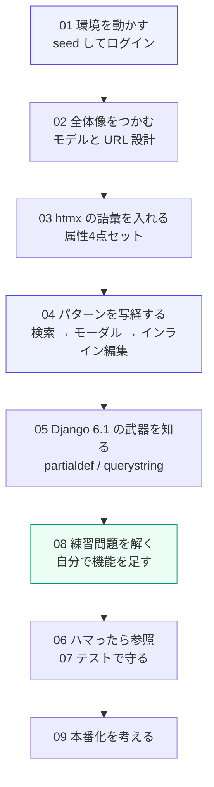

# ドキュメント目次

Django 6.1 + htmx 2 で社内 CRM を作りながら学ぶための資料です。
アプリのコードとセットで読むことを前提にしています。

| # | ドキュメント | 内容 |
|---|---|---|
| 01 | [はじめかた](01-getting-started.md) | 環境構築、起動、よく使うコマンド |
| 02 | [アーキテクチャ](02-architecture.md) | 全体像、データモデル、リクエストの流れ |
| 03 | [htmx 早見表](03-htmx-reference.md) | 属性・swap・trigger・ヘッダ・イベントの一覧 |
| 04 | [実装パターン集](04-patterns.md) | このアプリの20パターンをコード付きで解説 |
| 05 | [Django 6.1 の新機能](05-django-features.md) | テンプレートパーシャル、querystring、django-htmx |
| 06 | [ハマりどころ](06-pitfalls.md) | 実際に踏んだバグ 15 件と定番の落とし穴 |
| 07 | [テスト](07-testing.md) | **単体・結合・E2E の3層。Playwright あり** |
| 08 | [練習問題](08-exercises.md) | 手を動かして覚えるための課題 12 問 |
| 09 | [本番化チェックリスト](09-production.md) | 学習用のままだと困るところ |

---

## 学習ロードマップ

---

## 3行でわかる htmx

1. HTML の属性に「**いつ・どこへ・どこに・どう入れるか**」を書く
2. サーバは JSON ではなく **HTML の断片** を返す
3. 画面を書き換える指示は **レスポンスヘッダ**（`HX-Trigger` など）で送る

JavaScript でクライアント状態を持たないので、**状態はサーバにしか存在しない**。
これが htmx を使う一番の利点であり、設計上の制約でもあります。

---

## バージョン方針

| ライブラリ | このプロジェクト | 補足 |
|---|---|---|
| Python | 3.13 | `.python-version` で固定、uv が自動取得 |
| Django | 6.1 | テンプレートパーシャルは 6.0 から |
| htmx | 2.0.10 | npm の `latest` タグ。`next` に 4.0.0 があるが安定版は 2 系 |
| django-htmx | 1.29 | `request.htmx` とレスポンスヘッダのヘルパー |
| SortableJS | 1.15 | カンバンのドラッグ&ドロップにのみ使用 |
| Playwright | 1.62 | E2E テスト（開発時のみ） |

htmx 4 系は破壊的変更を含むメジャーアップデートで、まだ `next` タグ扱いです。
学習用途では 2 系（stable）を使うのが無難です。
